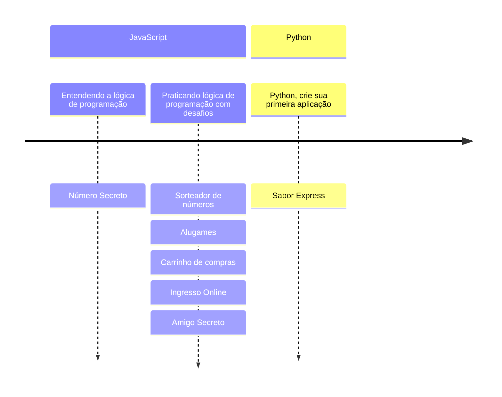

# ALURA
> Repositório dedicado aos projetos dos cursos da plataforma on-line ALURA
## A partir do zero: Iniciante em programação:
  ### Entendendo a lógica de pregramação:
  1. [Número secreto](https://github.com/BorgesMTP/ALURA/tree/main/numero-secreto)
  ### Praticando lógica de programação com desafios:
  1. [Sorteador de Números](https://github.com/BorgesMTP/ALURA/tree/main/sorteador-numeros)
  2. [AluGames](https://github.com/BorgesMTP/ALURA/tree/main/alugames)
  3. [Carrinho de Compras](https://github.com/BorgesMTP/ALURA/tree/main/carrinho-compras)
  4. [Ingresso Online](https://github.com/BorgesMTP/ALURA/tree/main/ingresso)
  5. [Amigo Secreto](https://github.com/BorgesMTP/ALURA/tree/main/amigo-secreto)
  ### Python: Crie sua primeira aplicação
  1. [Sabor Express](https://github.com/BorgesMTP/ALURA/tree/main/PYTHON_CRIE%20A%20SUA%20PRIMEIRA%20APLICA%C3%87%C3%83O)

