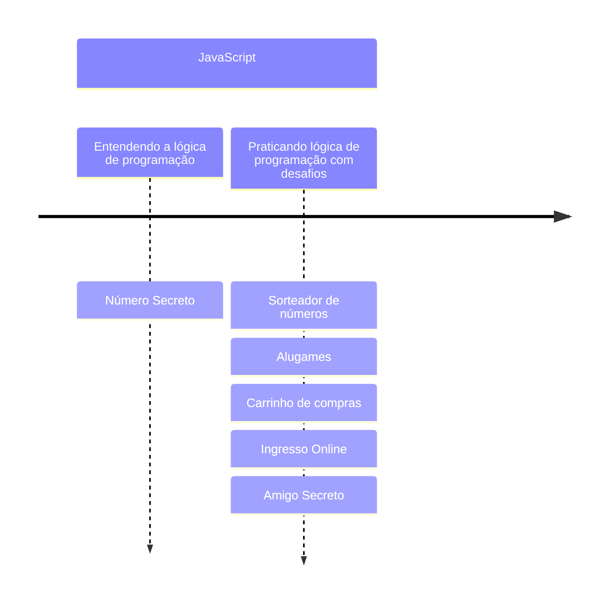

# ALURA
> Repositório dedicado aos projetos dos cursos da plataforma on-line ALURA
## A partir do zero: Iniciante em programação:
  ### Entendendo a lógica de pregramação:
  1. [Número secreto](https://github.com/BorgesMTP/ALURA/tree/main/numero-secreto)
  ### Praticando lógica de programação com desafios:
  1. [Sorteador de Números](https://github.com/BorgesMTP/ALURA/tree/main/sorteador-numeros)
  2. [AluGames](https://github.com/BorgesMTP/ALURA/tree/main/alugames)
  3. [Carrinho de Compras](https://github.com/BorgesMTP/ALURA/tree/main/carrinho-compras)
  4. [Ingresso Online]()
  5. [Amigo Secreto]()

